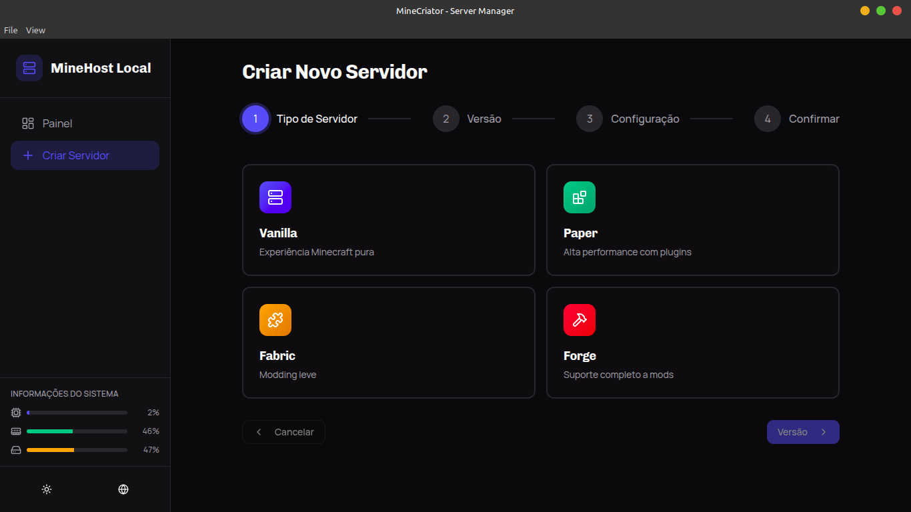
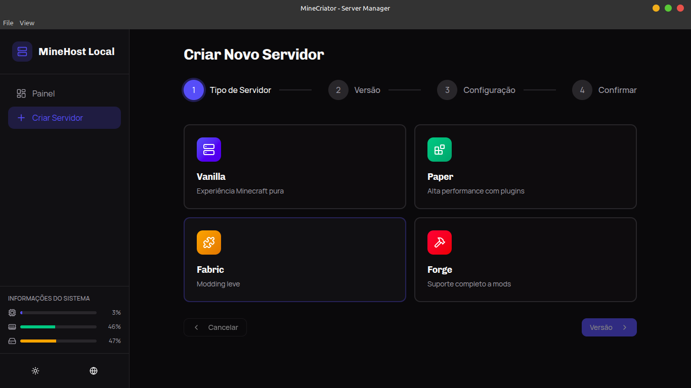
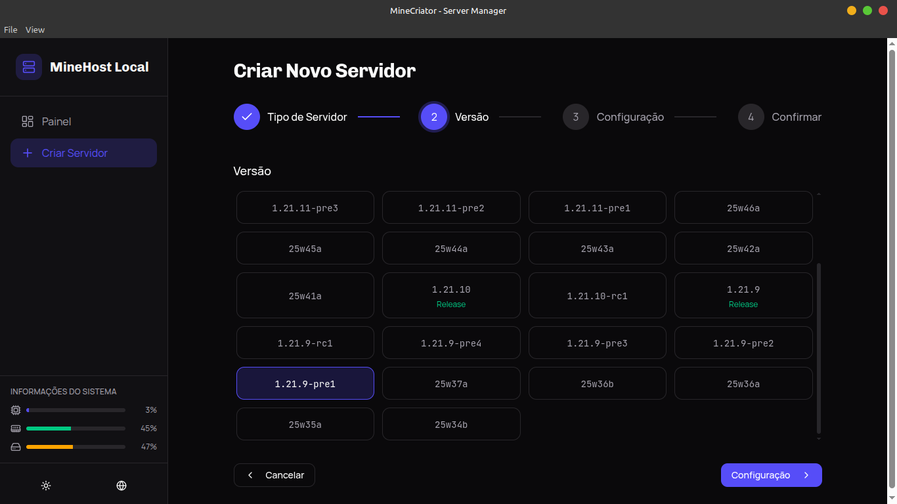

# MineHost Local - Minecraft Server Manager

Um gerenciador de servidores Minecraft robusto, local-first e **feito por dev para dev**. Interface moderna, controle total e zero dor de cabeça (mentira, só um pouquinho — afinal é Minecraft).

> Sim, ele roda local. Sim, ele cria servidor. Sim, você vai esquecer ele aberto enquanto o PC vira um aquecedor.

## Características

* 🖥️ **Interface Moderna (Dark Theme Lover)** — React + Tailwind CSS, porque CSS puro é sofrimento
* 🚀 **Backend em FastAPI** — rápido como Creeper silencioso
* 🧠 **Gerenciamento Completo** — criar, iniciar, parar, importar e deletar servidores
* 📊 **Monitoramento em Tempo Real** — logs ao vivo via WebSocket (spam incluído)
* 🖨️ **App Desktop** — Electron para Linux (.deb e AppImage)
* 🌐 **Responsivo** — funciona até naquele monitor velho que você jura que vai trocar

## Capturas de Tela

### Painel Principal


> Visão geral dos seus servidores. Simples, bonito e pronto para te julgar quando algo estiver offline.

### Criar Novo Servidor – Tipo



> Vanilla, Paper, Fabric ou Forge. Escolha com sabedoria (ou aleatoriamente, como todo mundo).

### Criar Novo Servidor – Versão



> Snapshots, releases, pré-releases… porque viver perigosamente faz parte da experiência.

### Servidor Criado



> IP copiado, botão de iniciar pronto e aquela falsa sensação de controle.

## Instalação

### Pré-requisitos

* Node.js 18+
* Python 3.9+
* Yarn ou npm
* Java 17+ (sem Java não tem Minecraft, sem choro)

### Instalação Local (Desenvolvimento)

```bash
# Clone ou extraia o repositório
cd Server-MineCriator-main

# Setup Frontend
cd frontend
yarn install

# Setup Backend
cd ..
python3 -m venv venv
source venv/bin/activate  # Windows: venv\Scripts\activate
pip install -r backend/requirements.txt
```

## Como Executar

### Opção 1: Web (Desenvolvimento)

**Terminal 1 – Backend**

```bash
cd Server-MineCriator-main
source venv/bin/activate
uvicorn backend.server:app --host 0.0.0.0 --port 5000 --reload
```

**Terminal 2 – Frontend**

```bash
cd Server-MineCriator-main/frontend
yarn start
```

Acesse: `http://localhost:3000`

### Opção 2: Desktop App (Electron)

```bash
cd Server-MineCriator-main/frontend

# Desenvolvimento com hot reload
yarn electron-dev

# Build desktop
yarn electron-build
```

### Opção 3: Build Distribuível (Linux)

```bash
cd Server-MineCriator-main/frontend
yarn dist
```

Gerados em `dist/`:

* `MineHost-Local.AppImage`
* `minehost-local.deb`

## Estrutura do Projeto

```
Server-MineCriator-main/
├── frontend/              # React + Electron
├── backend/               # FastAPI
├── electron/              # Configuração Electron
├── docs/screenshots/      # Prints bonitos para o README
└── venv/
```

## API Endpoints

* `GET /api/servers`
* `POST /api/servers`
* `POST /api/servers/{id}/start`
* `POST /api/servers/{id}/stop`
* `GET /api/servers/{id}/logs`
* `WS /ws/servers/{id}`

Swagger: `http://localhost:5000/docs`

## Troubleshooting

**"Java não encontrado"**

```bash
java -version
```

Se não funcionar: instale Java 17 e finja que sempre soube disso.

**Electron não inicia**

```bash
rm -rf ~/.config/MineHost\ Local
yarn electron-dev
```

## Licença

GNU General Public License (GPL)

---

**MineHost Local** — porque subir servidor Minecraft manualmente em 2026 já é crime moral.
